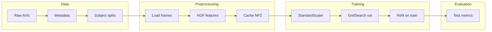

# Pipeline, Model Training, and Comparison to Schuldt et al. (IEEE 1334462)

This document explains how the KTH human-action classification pipeline works, how each model is trained, and how this implementation differs from the approach in **Schuldt, C., Laptev, I., & Caputo, B. (2004). Recognizing human actions: A local SVM approach.** *ICPR 2004.* DOI: [10.1109/icpr.2004.1334462](https://ieeexplore.ieee.org/document/1334462).

---

## 1. How the pipeline works

### 1.1 Data flow (high level)

1. **Raw KTH AVIs** — Videos (e.g. `person01_walking_d1_uncomp.avi`) under `data/raw/`.
2. **Metadata** — `src/data/dataset.py` scans for `.avi` files and parses subject id, action, and scenario from filenames; builds a table with `video_path`, `subject_id`, `scenario`, `action`, `action_id`.
3. **Subject-based splits** — `src/data/split.py` splits **subjects** (not clips) into train / val / test (e.g. 70% / 15% / 15%) with a fixed seed so all clips of a subject stay in one split (no identity leakage).
4. **Video loading** — For each split, videos are loaded with OpenCV: grayscale, **uniform sampling** to a fixed number of frames (e.g. 16) over time (`src/data/preprocess.py`).
5. **HOF feature extraction** — Dense optical flow (Farneback) is computed between consecutive frames; each frame pair is divided into a spatial grid (e.g. 5×5 blocks); per block, a **Histogram of Optical Flow** (HOF) with 9 bins is computed. Per video, the per–frame-pair HOF vectors are aggregated by **mean** and **max** over time, yielding a single fixed-dimension vector per video (`src/features/extract.py`).
6. **Caching** — Extracted features and labels per split are saved under `data/processed/` (e.g. `features_train_n16_b5x5_hof9_v1.npz`) so training does not recompute from video.
7. **Scaling** — At train time, `StandardScaler` is fit on the **train** set only; train, val, and test are transformed with this scaler.
8. **Model selection** — Grid search over model hyperparameters is run with the **validation set** used as the single “test” fold via `PredefinedSplit` (train samples get `test_fold=-1`, val samples get `test_fold=0`). The best configuration is chosen by validation balanced accuracy.
9. **Final model and test evaluation** — The best estimator is **refit on the training set only** (validation data is not used for the final fit). This model is evaluated once on the held-out **test set**; metrics are balanced accuracy, macro F1, and confusion matrix.

### 1.2 Pipeline diagram

### 1.3 Key scripts and config

| Step | Script | Config |
|------|--------|--------|
| Download | `scripts/download_data.py` | Kaggle credentials |
| Preprocess & features | `scripts/run_preprocess.py --config configs/data.yaml` | `configs/data.yaml` (paths, `n_frames`, `n_blocks_h`, `n_blocks_w`, `hof_bins`, split ratios) |
| Train SVM | `scripts/train_svm.py` | `configs/data.yaml`, `configs/model_svm.yaml` |
| Train Bayesian | `scripts/train_bayesian.py` | `configs/data.yaml`, `configs/model_bayesian.yaml` |
| Train k-NN | `scripts/train_knn.py` | `configs/data.yaml`, `configs/model_knn.yaml` |
| Compare models | `scripts/evaluate_all.py` | Reads `results/*/metrics.json` |

---

## 2. How the model works and trains

### 2.1 SVM (baseline)

- **Model**: `sklearn.svm.SVC` with RBF kernel and One-vs-Rest (`decision_function_shape='ovr'`).
- **Input**: Scaled feature matrix from cached HOF (one row per video).
- **Training**:  
  - Scale train and val with `StandardScaler` fit on train.  
  - Merge scaled train and val into a single array; build `PredefinedSplit(test_fold)` with train indices `-1` and val indices `0`.  
  - `GridSearchCV(..., cv=PredefinedSplit(...), scoring='balanced_accuracy')` over `C` and `gamma` (from `configs/model_svm.yaml`).  
  - The best estimator from grid search is **cloned and refit on the training set only**; this is the model saved and used for test evaluation.

### 2.2 Bayesian (Gaussian Naive Bayes)

- **Model**: `sklearn.naive_bayes.GaussianNB`.
- **Training**: Same pattern as SVM: scale (fit on train), merge train+val, `PredefinedSplit`, grid search over `var_smoothing` on the validation set, then refit the best estimator on train only. Config: `configs/model_bayesian.yaml`.

### 2.3 k-NN

- **Model**: `sklearn.neighbors.KNeighborsClassifier` (e.g. uniform weights).
- **Training**: Same pattern: scale, PredefinedSplit, grid search over `n_neighbors` and `metric` on the validation set, then refit best estimator on train only. Config: `configs/model_knn.yaml`.

### 2.4 Training flow summary

1. Load cached features: `(X_train, y_train)`, `(X_val, y_val)`, `(X_test, y_test)`.
2. Fit `StandardScaler` on `X_train`; transform train, val, and test.
3. Build `PredefinedSplit`: train samples `test_fold=-1`, val samples `test_fold=0`; merge train and val into one dev set.
4. Run `GridSearchCV` on the dev set with this `cv` so that the only “test” fold is the validation set.
5. Clone the best estimator and refit it on the **training set only**.
6. Predict on the test set with this refit model; compute balanced accuracy, macro F1, and confusion matrix.

---

## 3. Differences from IEEE 1334462 (Schuldt et al.)

Our pipeline follows the same high-level idea (spatiotemporal features + SVM for action recognition) but uses a **simplified, dense feature pipeline** (Option A in the project implementation plan) rather than space-time interest points and local descriptors (Option B / paper-style).

| Aspect | Our implementation | Schuldt et al. (ICPR 2004, template for SVM) |
|--------|--------------------|------------------------------------------------|
| **Features** | Dense optical flow (Farneback) on a fixed spatial grid; block-based HOF histograms; **mean and max** over time → one vector per video. | **Space-time interest points** (local events); **local descriptors** (e.g. HOG/HOF at those points); bag-of-words or histogram aggregation. |
| **Representation** | Single fixed-dimension vector per video (no interest-point detection, no codebook). | Local patches at detected interest points; often codebook + histogram. |
| **Train/val/test split** | Subject-based 70% / 15% / 15% of 25 subjects (random with seed). | Typically **8 train / 8 val / 9 test subjects** (official KTH split). |
| **SVM** | Multi-class SVC with RBF kernel, OVR; C and gamma tuned via grid search on a held-out validation set (PredefinedSplit). | SVM with “local” approach; kernel and exact setup as in paper (e.g. histogram kernels possible). |
| **Evaluation** | Balanced accuracy, macro F1, confusion matrix on held-out test set. | Reported accuracy on the designated test set. |

In short: we use **dense grid HOF + mean/max aggregation** and **RBF SVM with validation-based tuning**; the paper uses **space-time interest points + local descriptors** and an official KTH subject split, with SVM details as in the original paper.

---

## 4. What the metrics mean (plain English)

- **Accuracy**: Fraction of test videos where the predicted action matches the true action. Simple “how many correct?” but can be misleading if some actions are much more frequent than others (e.g. always predicting “walking” can look good if walking is dominant).

- **Balanced accuracy**: Average of per-class recall (for each action, “what fraction of true X did we correctly label as X?”). Each of the 6 actions is weighted equally, so doing well on rare actions matters as much as on common ones. **0.60** means we’re right about 60% of the time when each class is treated equally.

- **Macro F1**: For each action we compute F1 (balance of precision and recall), then average over the 6 actions. Again, every class counts equally. **0.60** means a similar “average quality” of predictions across all actions. Good when you care about every class, not just the big ones.

We report balanced accuracy and macro F1 so that small or hard classes (e.g. handclapping) are not drowned out by easier or more frequent ones (e.g. walking).

---

## 5. How our results compare to published work

Reported results on KTH in the literature (same 6 actions, subject-based or official split):

| Setting | Reported performance | Notes |
|--------|----------------------|--------|
| **Our SVM (dense HOF, RBF)** | **~60%** balanced acc / accuracy | Simplified features (no interest points), 70/15/15 subject split, validation-based tuning. |
| **Our Bayesian** | **~45%** | Same features; Gaussian NB is a weaker model for this task. |
| **Our k-NN** | **~39%** | Same features; distance-based on raw HOF vectors. |
| **Schuldt et al. (2004)** | Baseline for the dataset | Local SVM with space-time interest points and local descriptors (HOG/HOF); exact number varies by split and setup. |
| **Laptev et al. (space-time interest points, improved)** | **~91.8%** | Strong hand-crafted features (space-time interest points, pyramids, multi-channel SVM). |
| **Later work (e.g. contextual stats of space-time features)** | **~96%** | Even more refined hand-crafted or hybrid pipelines. |
| **Deep learning (e.g. CNN-GRU)** | Often **90%+** | Learned representations on raw or preprocessed video. |

**Takeaway**: Our **~60%** SVM result is reasonable for a **simplified classical pipeline** (dense HOF + mean/max, no interest points, no codebook). It is well below **~92–96%** from stronger hand-crafted (interest-point + descriptor) or deep-learning methods. The gap is expected: we use a cheaper, easier-to-implement feature design (Option A) rather than the full paper-style pipeline (Option B) or learned features. Improving toward 90%+ would require either adopting space-time interest points and better descriptors or moving to a deep-learning model.
